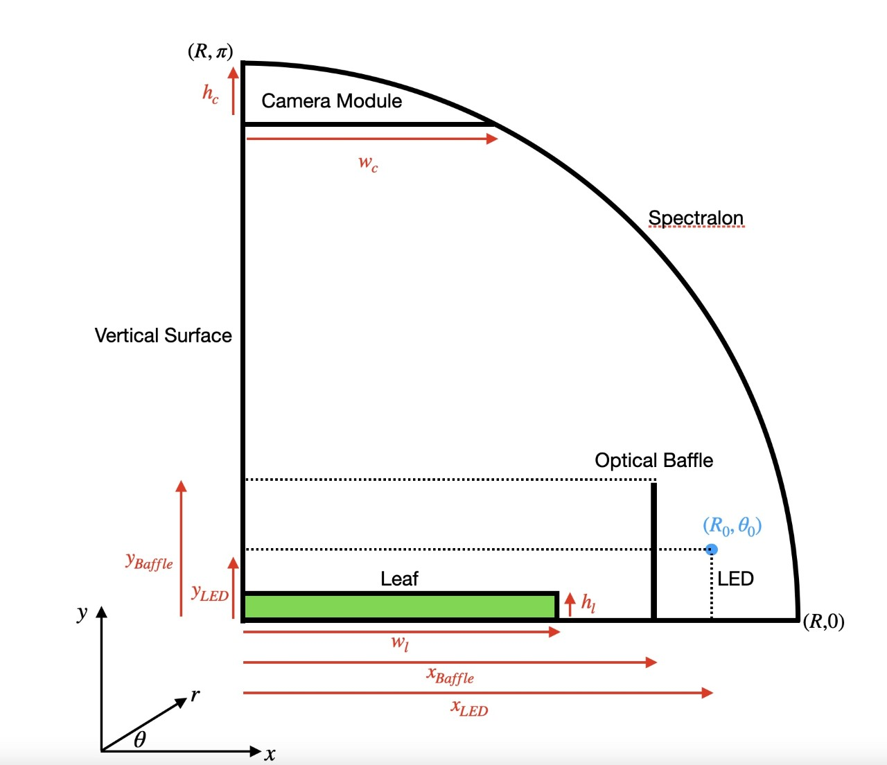

# Enhancing Optical Imaging for Crop Science.
# 2D Simulation Code.
This is a 2D simulation of a 3D device, used to study bioflourescence in leaves. The initial geometry is shown below.

Photons emit from the LED, following a sinusoidal probability distribution, and reflect of various surfaces until they are absorbed by the leaf. The points on the x axis where the photons are absorbed are recorded and outputted. 

The purpose of this is to study the uniformity of illumination.
(In collaboration with @JackAYoung301)

  

Week 5 Changes:
 - Added partial specularity
 - Added absorption of camera
 - Added histograms of absorption position and angle data

Week 6 Changes:
 - Added 2D KDE plot
 - Changed baseline to Lambertian reflector
 - Added absorption factor into hemisphere and baseline
 - Fixed issue where camera_intersect wasn't working properly
 - Added position of interaction log
 - Started tracing rays graphically
 - Added tqdm progress bar

Week 7 Changes:
 - New Lambertian Model
 - Added baffler
 - Camera absorption position/angle plots
 - New schematic:

  

Week 8 Changes:
 - Added comparison to experimental model

Week 9 Changes:
 - Added chi-squared calculations for experimental model and uniformity
 - Added diffuser

Week 10 Changes:
 - Now 2 different branches: match and optomize
 - Match contains lens transformation
 - Optomize code wrapped in a function  and SciPy minimize used to find optimum baffle position
